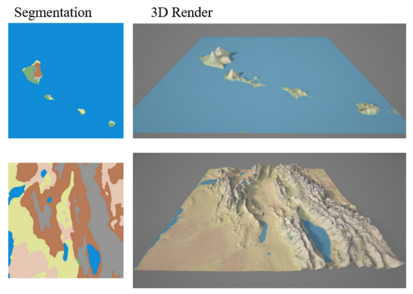
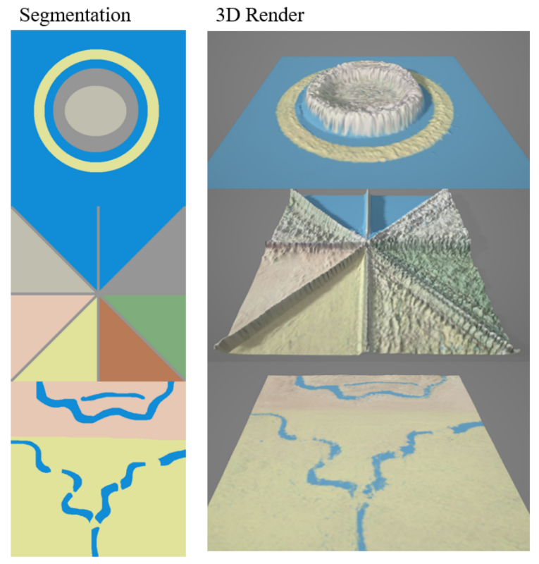
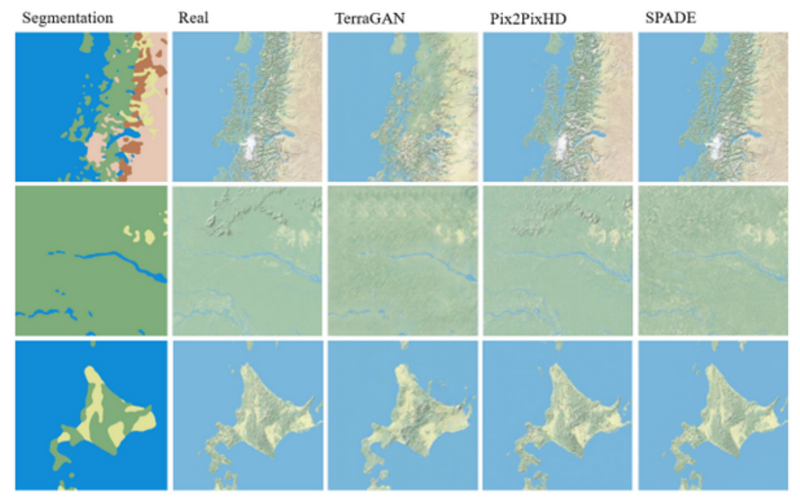

# TerraGAN

This is a condistional GAN model trained to generate 3D terrain using an input segmentation map. Architecture consists of a U-Net generator and a PatchGAN discriminator. Built using Pytorch and monitored using MLFlow.

Submission for University of Lincoln MSc Intelligent Vision Thesis 2022.

## Abstract

There is an increasing demand for assets in games and simulations as they are constantly becoming larger and more complex. Modelling terrain is challenging when it needs to be produced quickly and realistically, especially by solo developers or companies with tight time limits. A recent machine learning method called a conditional Generative Adversarial Network (cGAN) has been introduced that is able to generate images constrained by a label (or a semantic segmentation) and learns from a dataset with corresponding labels. This project proposes a method for using a cGAN to automatically generate terrain, including a texture and a height map. Users can input an image label containing different types of terrain, like water, forest or mountains, and quickly receive an output of generated 3D terrain. This report shows that terrain synthesis is possible with realistic results and how changing different model hyperparameters affects the generation. The models in this project were trained on low-resolution data, but with more computational power, higher-resolution models can be trained to produce much more detailed results.

## Results

### Realistic Inputs



### Unrealistic Inputs



### Comparison



## Install

```
pip install -r requirements.txt
```

## Run

### Train

```
python src/train.py
```